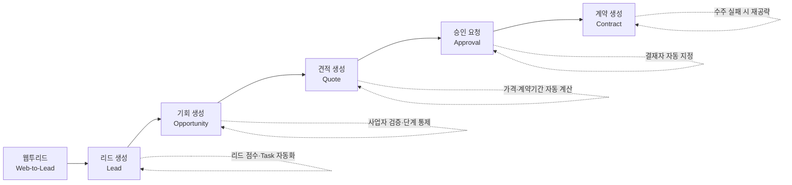
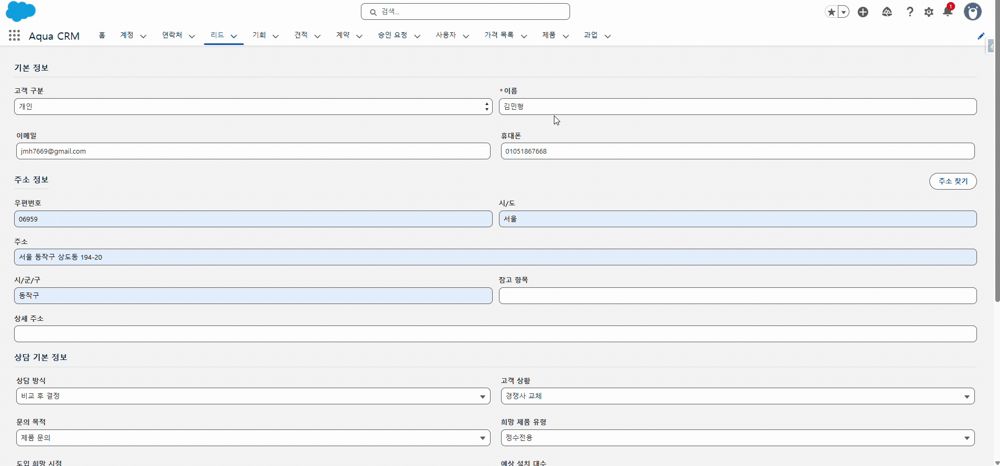
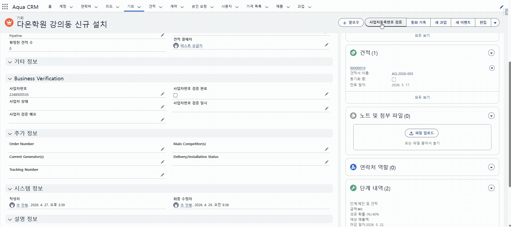
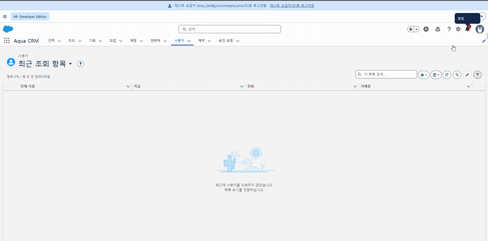
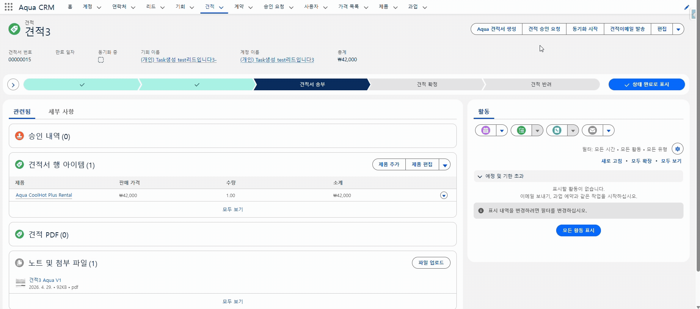
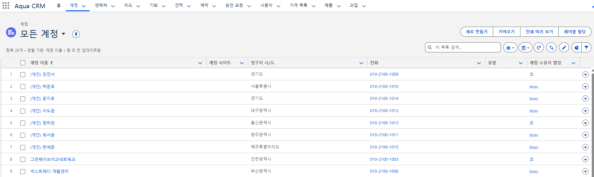
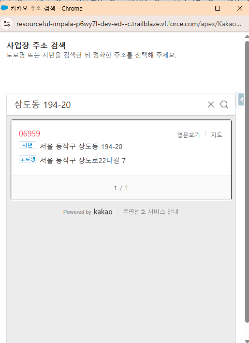
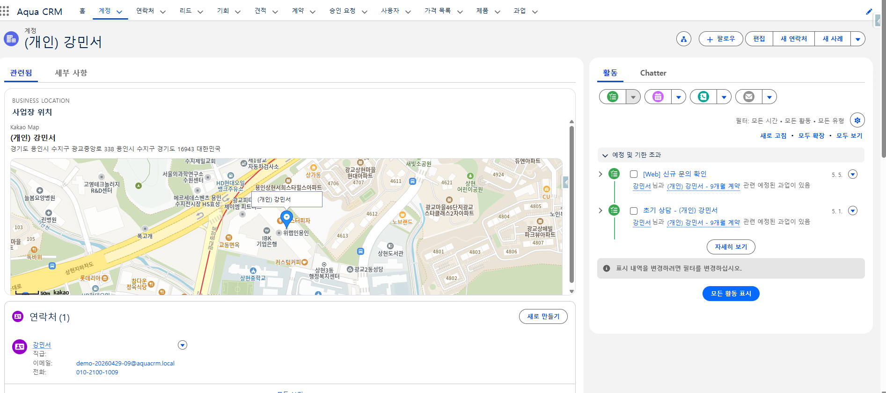
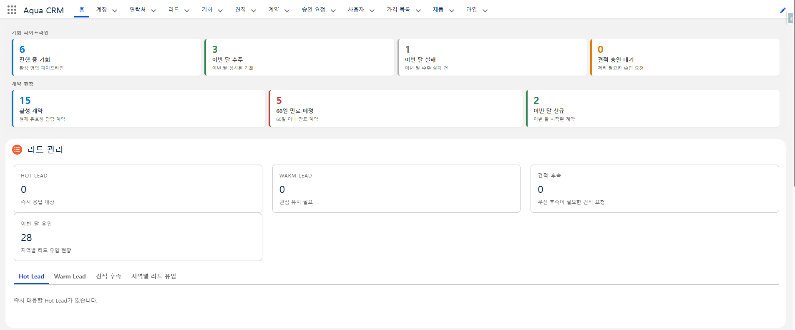
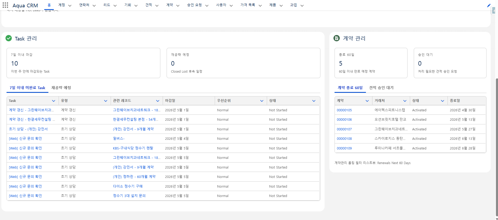

# Aqua Service

> **렌탈·구매가 모두 가능한 정수기 업체 `Aqua`를 위한 Salesforce Sales Cloud 영업 프로세스 개선 프로젝트**
> 리드 유입부터 계약 체결까지 이어지는 영업 흐름을 자동화하고, 사용자 중심 화면으로 업무 효율을 높였습니다.


<sub>작성자 · 조민형 (DX 1본부 2팀)</sub>

---

## 목차

1. [프로젝트 개요](#1-프로젝트-개요)
2. [왜 만들었는가](#2-왜-만들었는가)
3. [전체 프로세스 흐름](#3-전체-프로세스-흐름)
4. [비즈니스 로직 개선](#4-비즈니스-로직-개선)
5. [사용자 관점 개선](#5-사용자-관점-개선)
6. [아쉬웠던 점 & 향후 개선](#6-아쉬웠던-점--향후-개선)
7. [기술 스택 & 프로젝트 구조](#7-기술-스택--프로젝트-구조)
8. [부록 — 작업 이력 · 운영 규칙 · 주요 파일](#부록--작업-이력--운영-규칙--주요-파일)

---

## 1. 프로젝트 개요

`Aqua Service`는 Salesforce Sales Cloud를 기반으로 정수기 렌탈·구매 영업의 전 과정을
한 흐름으로 잇는 CRM 프로젝트입니다. **Web-to-Lead 유입 → 리드 → 기회 → 견적 → 승인 → 계약**으로
이어지는 표준 영업 단계에서, 반복 수작업을 자동화하고 영업 담당자가 우선순위를
한눈에 파악할 수 있도록 화면을 재설계했습니다.

| 영역 | 핵심 내용 |
| :--- | :--- |
| **01. Lead 관리** | 리드 점수화, 상담 유형·라우팅 그룹 자동 분류, 후속 Task SLA 자동화 |
| **02. Opportunity 흐름** | 국세청 API 사업자 검증, 단계 진행 통제, 가격·계약기간 자동 계산 |
| **03. Quote 승인** | 견적 승인 요청 자동화, 결재자 자동 지정, 상태 동기화 |
| **04. Contract 생성** | 수주 완료 시 계약 자동 생성, 수주 실패 시 재공략 Task 자동화 |

---

## 2. 왜 만들었는가

기존 영업 프로세스는 단계마다 사용자가 직접 객체를 오가며 상태를 바꿔야 했고,
리드·계약 데이터가 "생성과 종료" 중심으로만 관리되어 후속 영업 흐름이 끊겼습니다.

| 🔴 기존 프로세스 문제점 | 🔵 개선 목표 |
| :--- | :--- |
| 각 단계 완료 후 사용자가 직접 관련 객체로 이동해 상태를 변경해야 함 | 객체 간 상태 변경을 **자동화**하여 반복 업무와 누락을 줄임 |
| 견적·계약 완료 등 반복 수작업으로 상태 변경 누락·업무 지연 발생 | 리드부터 계약까지 고객 데이터를 **체계적으로 관리** |
| 리드·계약 데이터가 단순 생성/종료 중심이라 후속 영업 흐름이 부족 | 사용자 친화적 **UI/UX**로 정보 접근성과 처리 속도를 높임 |
| 화면 접근 경로가 길고 현재 진행 상황을 직관적으로 파악하기 어려움 | |

---

## 3. 전체 프로세스 흐름



각 단계는 Trigger·Apex Handler·Flow가 맞물려 동작하며, 4장에서 단계별 개선 내용을
**Before / After**와 실제 화면 증적으로 설명합니다.

---

## 4. 비즈니스 로직 개선

> 단계 완료 후 상태 변경을 자동화하고, 핵심 기준을 시스템으로 검증하며,
> 리드–기회–견적–계약 데이터 흐름이 끊기지 않도록 연결성을 강화했습니다.

### 4.1 리드 자동 분류 및 후속 Task 생성

유입된 리드를 점수화해 우선순위를 표준화하고, 등급에 맞춰 후속 상담 Task를 자동 생성합니다.

| BEFORE | AFTER |
| :--- | :--- |
| 유입 리드를 담당자가 직접 판단하고 우선순위를 수동 정리 | 리드 점수·상담 유형·라우팅 그룹을 **자동 계산**해 우선순위 표준화 |
| 후속 상담 Task 생성 기준이 없어 대응 속도가 들쭉날쭉 | Hot/Warm 리드와 계약 갱신 대상에 **후속 Task 자동 생성** |

**리드 점수 산정 기준** — 문의 목적 · 도입 희망 시점 · 예산 · 고객 상황 · 계약 종료 시점 · 설치 규모

| 등급 | 기준 점수 | 후속 Task SLA |
| :--- | :--- | :--- |
| 🔥 **Hot** | 80점 이상 | 1일 SLA Task 생성 + 즉시 확인 알림 |
| 🌤 **Warm** | 55점 이상 | 3일 SLA Task 생성 |
| ❄️ **Cold** | 54점 이하 | 즉시 대응 Task 미생성 |
| 🔁 **Renewal Watch** | 렌탈 + 계약 종료 31~90일 | 7일 SLA 갱신 Task 생성 |

<p align="center">
  
</p>

<p align="center"><sub>▶ <a href="docs/assets/process/01-lead-auto-classification.mp4">원본 영상으로 보기</a> · <a href="docs/assets/process/01-lead-classification-detail.png">분류 결과 상세 화면</a></sub></p>

**관련 코드** — [`LeadSalesAutomationHandler.cls`](force-app/main/default/classes/lead/LeadSalesAutomationHandler.cls) · [`LeadTrigger.trigger`](force-app/main/default/triggers/LeadTrigger.trigger) · [`SalesTaskSupport.cls`](force-app/main/default/classes/common/SalesTaskSupport.cls) · 운영 규칙은 [`LEADSCORE.md`](LEADSCORE.md) 참고

---

### 4.2 사업자 검증 기반 수주 통제

기회 단계 상승 전 사업자번호를 검증해, 신뢰할 수 없는 거래처가 수주 완료로 넘어가는 것을 막습니다.

| BEFORE | AFTER |
| :--- | :--- |
| 사업자번호 확인 없이도 기회 단계를 올릴 수 있어 데이터 신뢰도 저하 | **국세청 API**로 사업자번호를 검증하고 결과를 Opportunity에 저장 |
| 검증 결과가 수기로 남아 추적이 어려움 | 법인은 검증 완료 전 **수주 완료 단계 진입 차단**, 개인은 예외 처리 |

<p align="center">
  
</p>

<p align="center"><sub>▶ <a href="docs/assets/process/02-business-verification.mp4">원본 영상으로 보기</a></sub></p>

**관련 코드** — [`BusinessStatusService.cls`](force-app/main/default/classes/common/BusinessStatusService.cls) · [`OpportunityBusinessVerificationHandler.cls`](force-app/main/default/classes/opportunity/OpportunityBusinessVerificationHandler.cls) · [`OpportunityStageGuardHandler.cls`](force-app/main/default/classes/opportunity/OpportunityStageGuardHandler.cls) · [`SCF_Opportunity_Business_Status_Verification`](force-app/main/default/flows/SCF_Opportunity_Business_Status_Verification.flow-meta.xml)

---

### 4.3 견적 승인 프로세스 자동화

견적 승인 요청과 결재 상태 관리를 한 흐름으로 묶어, 미승인 견적이 다음 단계로 넘어가지 않도록 통제합니다.

| BEFORE | AFTER |
| :--- | :--- |
| 승인 요청과 결재 상태 관리가 분리돼 누락 위험 | Opportunity/Quote에서 바로 **승인 요청 생성** 후 결재자에게 알림 발송 |
| 승인되지 않은 견적도 다음 단계로 진행 가능 | 승인 여부에 따라 Quote·Opportunity 상태가 **자동 반영** |

> 💡 결재자는 수동 지정 대신 **계정 담당자(Account Owner)의 상위 매니저**에서 자동으로 결정됩니다.

<p align="center">
  
</p>

<p align="center"><sub>▶ <a href="docs/assets/process/03-quote-approval.mp4">원본 영상으로 보기</a></sub></p>

**관련 코드** — [`QuoteApprovalService.cls`](force-app/main/default/classes/quote/QuoteApprovalService.cls) · [`QuoteApprovalWorkspaceController.cls`](force-app/main/default/classes/quote/QuoteApprovalWorkspaceController.cls) · [`QuoteStatusGuardHandler.cls`](force-app/main/default/classes/quote/QuoteStatusGuardHandler.cls) · [`SCF_Quote_Approval_Request`](force-app/main/default/flows/SCF_Quote_Approval_Request.flow-meta.xml)

---

### 4.4 가격 및 계약기간 자동 계산

렌탈·구매 가격 구조를 분리하고, 라인아이템 기준으로 금액과 계약기간을 자동 집계합니다.

| BEFORE | AFTER |
| :--- | :--- |
| 렌탈료·구매금액·총액·계약기간을 수작업으로 계산 | `QuoteLineItem`/`OpportunityLineItem` 기준 **금액·계약기간 자동 계산** |
| 견적과 기회 간 금액 불일치가 발생하기 쉬움 | 리드–기회–견적 간 금액 흐름을 **일관되게 동기화** |

**가격 공식**

```text
렌탈 총액 = 월 렌탈료 × 계약기간(개월) + 설치비
구매 총액 = 구매 금액 + 설치비
```

계약 종료일을 기준으로 `30일 이내 / 31~60일 / 61~90일 / 90일 초과`로 구간화하여,
종료가 임박한 렌탈 고객에게는 계약 갱신 Task를 자동 생성합니다.

<p align="center">
  
</p>

<p align="center"><sub>▶ <a href="docs/assets/process/04-price-calculation.mp4">원본 영상으로 보기</a></sub></p>

**관련 코드** — [`AquaPricingSupport.cls`](force-app/main/default/classes/common/AquaPricingSupport.cls) · [`OpportunityLineItemTrigger.trigger`](force-app/main/default/triggers/OpportunityLineItemTrigger.trigger) · [`QuoteLineItemTrigger.trigger`](force-app/main/default/triggers/QuoteLineItemTrigger.trigger) · 가격 규칙은 [`PRICING_RULES.md`](PRICING_RULES.md) 참고

---

### 4.5 계약 자동 생성 및 재공략 관리

수주 완료 시 계약을 자동 생성하고, 수주 실패 건도 후속 재공략 흐름으로 데이터를 남깁니다.

| BEFORE | AFTER |
| :--- | :--- |
| 수주 완료 후 계약 생성·연결 작업을 수동 처리 | 수주 완료 시 표준 **계약을 자동 생성**하고 견적과 연결 |
| 수주 실패 건은 후속 재공략이 체계적으로 남지 않음 | 수주 실패 시 **재오픈 가능성에 따라 재공략 Task 자동 생성** |

<p align="center">
  
</p>

<p align="center"><sub>▶ <a href="docs/assets/process/05-contract-automation.mp4">원본 영상으로 보기</a></sub></p>

**관련 코드** — [`RTF_Create_Contract_for_Completed_Opportunity`](force-app/main/default/flows/RTF_Create_Contract_for_Completed_Opportunity.flow-meta.xml) · [`OpportunityReengagementHandler.cls`](force-app/main/default/classes/opportunity/OpportunityReengagementHandler.cls)

---

## 5. 사용자 관점 개선

> 반복 입력 부담을 줄이고, 사용자가 "지금 무엇을 해야 하는지"를 화면 중심으로
> 빠르게 파악할 수 있도록 입력·조회 경험을 다시 설계했습니다.

### 5.1 개인/법인 리드 생성 화면 개선

| BEFORE | AFTER |
| :--- | :--- |
| 개인 고객도 회사명을 직접 입력해야 해 입력이 불편 | 개인/법인 구분을 추가하고, 개인은 회사명을 `(개인) 이름`으로 **자동 생성** |
| 웹투리드와 직접 생성 화면의 입력 기준이 일관되지 않음 | 웹투리드와 리드 생성 버튼 모두 **같은 입력 기준으로 통일** |

<p align="center">
  
</p>

**관련 코드** — [`CustomerIdentitySupport.cls`](force-app/main/default/classes/common/CustomerIdentitySupport.cls) · `aura/leadCreateAction` · `aura/leadListQuickActionLauncher`

---

### 5.2 카카오 주소 검색 및 지도 연동

| BEFORE | AFTER |
| :--- | :--- |
| 주소를 직접 입력해야 해 오입력 가능성이 높음 | **카카오 우편번호 검색**으로 주소를 간편하게 입력 |
| 거래처·연락처 위치를 화면에서 바로 확인하기 어려움 | Account/Contact 화면에서 **카카오 지도**를 바로 확인 |

<p align="center">
  
  
</p>

**관련 코드** — [`KakaoPostcodePicker.page`](KakaoPostcodePicker.page) · `lwc/accountBusinessMap` · `lwc/contactKakaoMap`

---

### 5.3 영업 홈 대시보드 구성

| BEFORE | AFTER |
| :--- | :--- |
| 리드·Task·계약·승인 대기를 각각 따로 확인 | 홈 화면에서 KPI · Hot Lead · SLA 임박 Task · 계약 종료 예정 · 승인 대기를 **통합 제공** |
| 오늘 우선 처리해야 할 업무가 한눈에 보이지 않음 | 영업 담당자가 **우선순위를 즉시 판단**할 수 있도록 구성 |

<p align="center">
  
  
</p>

**관련 코드** — [`SalesRepHomeController.cls`](force-app/main/default/classes/lead/SalesRepHomeController.cls) · `lwc/salesHomeWorkspace` · `lwc/salesHomeKpiBar` · `lwc/salesHomeLeadManager` · `lwc/salesHomeTaskManager` · `lwc/salesHomeContractManager`

---

## 6. 아쉬웠던 점 & 향후 개선

| # | 주제 | 내용 |
| :---: | :--- | :--- |
| 1 | **다각적 데이터 분석 및 사후 관리** | 리드와 완료된 계약은 체계적으로 관리했으나, 미전환 데이터를 분석에 더 적극적으로 활용하지 못한 점이 아쉬웠습니다. |
| 2 | **비즈니스 프로세스 표준화** | 영업 담당자가 바뀌어도 영업 효율이 흔들리지 않도록, 각 단계에서 시스템이 최적의 액션을 제안하는 가이드라인을 구축하지 못했습니다. |
| 3 | **능동적 업무 트리거 환경** | 데이터 변화를 실시간으로 감지해 업무 우선순위를 자동으로 트리거하는 환경까지는 구현하지 못했습니다. |

---

## 7. 기술 스택 & 프로젝트 구조

### 기술 스택

| 구분 | 내용 |
| :--- | :--- |
| **플랫폼** | Salesforce Sales Cloud |
| **백엔드 로직** | Apex — 18개 클래스 + 13개 테스트 클래스, 5개 Trigger |
| **화면** | Lightning Web Components 16개, Aura 4개, Visualforce (견적 PDF·주소 검색) |
| **자동화** | Flow 5개 (계약 자동 생성, 사업자 검증, 견적 승인 요청 등) |
| **외부 연동** | 국세청 사업자등록 상태 API, 카카오 우편번호·지도 API |
| **개발 도구** | Salesforce CLI (SFDX), Jest (LWC 단위 테스트), ESLint |

### 프로젝트 구조

```text
4th_Project/
├─ force-app/main/default/
│  ├─ classes/
│  │  ├─ common/        AquaPricingSupport, BusinessStatusService, CustomerIdentitySupport ...
│  │  ├─ lead/          LeadSalesAutomationHandler, SalesRepHomeController, LeadConversionWorkspaceController
│  │  ├─ opportunity/   OpportunityBusinessVerificationHandler, OpportunityReengagementHandler ...
│  │  └─ quote/         QuoteApprovalService, QuotePdfGenerationService, QuoteStatusGuardHandler ...
│  ├─ triggers/         Lead / Opportunity / Quote / LineItem 트리거
│  ├─ flows/            계약 자동 생성·사업자 검증·승인 요청 Flow
│  ├─ lwc/              영업 홈·워크스페이스·지도 등 16개 컴포넌트
│  ├─ aura/             리드·연락처 생성 Quick Action UI
│  ├─ pages/            AquaQuotePdf 등 Visualforce 페이지
│  └─ objects/          Lead / Opportunity / Quote / Contract 커스텀 필드·검증 규칙
├─ docs/assets/         README 화면 증적 (process · user)
├─ scripts/             샘플 데이터 리셋 등 Apex 스크립트
├─ LEADSCORE.md         리드 점수·상담 유형·라우팅 그룹 운영 문서
└─ PRICING_RULES.md     렌탈/구매 가격 계산 규칙 문서
```

### 도메인별 설계 메모

- 도메인 로직은 Trigger → Handler(Apex) 패턴으로 분리하고, 클래스는
  `common / lead / opportunity / quote` 하위 폴더로 정리했습니다.
- Apex 도메인 로직마다 테스트 클래스를 함께 두어 핵심 시나리오를 검증합니다.
- 리드 점수·가격 규칙 등 운영 규칙은 [`LEADSCORE.md`](LEADSCORE.md), [`PRICING_RULES.md`](PRICING_RULES.md)에 별도 문서로 관리합니다.

---

## 부록 — 작업 이력 · 운영 규칙 · 주요 파일

<details>
<summary><b>📋 운영 규칙 (Current Rules)</b></summary>

<br/>

- `Hot`: 80점 이상, 1일 SLA Task 생성, 즉시 확인 알림 전송
- `Warm`: 55점 이상, 3일 SLA Task 생성
- `Cold`: 54점 이하, 즉시 대응 Task 미생성
- `Renewal Watch`: `렌탈`이며 계약 종료가 `31-60일` 또는 `61-90일`이면 7일 SLA Task 생성
- `영업 Task 유형`: `초기 상담` / `견적 후속` / `계약 갱신` / `구매 전환` / `재공략`
- `계약 종료 윈도우`: 미입력 / 종료 지남 / 30일 이내 / 31-60일 / 61-90일 / 90일 초과
- `Task 액션 유형`: 초기 상담 / 경쟁사 교체 제안 / 렌탈 갱신 / 구매 전환 / 대형 설치 검토 / 견적 후속
- `상담 유형`: 초기 상담 / 견적 상담 / 데모 상담 / 기술 상담 / 파트너 상담 / 경쟁사 교체 상담 / 렌탈 갱신 상담 / 구매 전환 상담 / 대형 설치 상담
- `영업 라우팅 그룹`: 인바운드 / 인사이드 세일즈 / 리텐션 / 전략 영업 / 엔터프라이즈 / 파트너
- `Closed Lost`가 `재오픈 가능성 = 높음/보통`이면 재공략 Task를 자동 생성합니다.
- 렌탈 총액 기준은 `월 렌탈료 x 계약기간 + 설치비`입니다.
- 구매 총액 기준은 `구매 총액 + 설치비`입니다.
- 리드 예상 금액은 제품 유형, 수량, 서비스 선호도, 렌탈/구매 방식 기준으로 자동 계산합니다.
- 기회 실무 총액은 표준 `Amount` 대신 `Calculated_Total_Amount__c`를 기준으로 봅니다.
- 견적 최종 제안 금액은 `Total_Quoted_Amount__c`를 기준으로 봅니다.
- 견적은 `견적 유형`으로 `렌탈안 / 구매안 / 렌탈/구매 병행`을 구분합니다.
- `렌탈안` 또는 `렌탈/구매 병행` 견적은 `렌탈 기간(개월)`이 없으면 저장할 수 없습니다.
- 수동 리드 생성은 웹투리드와 같은 상담 필드 구조를 따르며, 이름은 단일 `이름` 입력으로 받아 `LastName`에 저장합니다.

</details>

<details>
<summary><b>🗂 작업 이력 (Work Log)</b></summary>

<br/>

- 2026-04-27: Task에 `영업 Task 유형` 커스텀 필드를 추가하고, 리드 후속 Task를 `초기 상담 / 견적 후속 / 계약 갱신 / 구매 전환` 체계로 표준화했습니다.
- 2026-04-27: Opportunity가 `수주 실패`로 전환되면서 `재오픈 가능성`이 `높음/보통`이면 `재공략` Task가 자동 생성되도록 `OpportunityReengagementHandler`를 추가했습니다.
- 2026-04-27: `salesRepHomeSummary`와 `SalesRepHomeController`를 확장해 `오늘 처리할 Hot Lead`, `SLA 임박 Task`, `계약 종료 30일 이내 고객`, `이번 달 견적 승인 대기`, `Closed Lost 재공략 예정`, `지역별 리드 유입`을 한 화면에서 보도록 구성했습니다.
- 2026-04-27: Lead 레코드 페이지 `FlexiPage4`에 영업 자격화/유입/지역 필드를 노출하고, Contract 리스트뷰에 `Renewals Next 60 Days` 롤링 필터를 추가했습니다.
- 2026-04-27: Opportunity가 `계약 생성` 또는 `마감됨` 단계로 들어오면 동기화 Quote 기준으로 표준 Contract를 자동 생성하고 Quote의 `ContractId`를 연결하는 `RTF_Create_Contract_for_Completed_Opportunity` Flow를 추가했습니다.
- 2026-04-27: 렌탈/구매 가격 구조를 분리하기 위해 `Product2.Aqua_Pricing_Type__c`와 리드/기회/견적 가격 계산 필드를 추가하고, `AquaPricingSupport`로 리드 예상 금액, 기회 실무 총액, 견적 최종 제안 금액을 자동 계산하도록 정리했습니다.
- 2026-04-27: `OpportunityLineItemTrigger`, `QuoteLineItemTrigger`를 추가해 라인아이템 변경 시 기회/견적 가격이 다시 집계되도록 구성했습니다.
- 2026-04-27: Aqua 견적 PDF가 `Total_Quoted_Amount__c`를 우선 사용하도록 수정하고, `렌탈 계약 총액 / 구매 총액 / 최종 제안 금액`이 보이도록 문서를 보강했습니다.
- 2026-04-27: 계약 자동 생성 Flow의 완료 단계 기준을 `수주 완료`로 맞추고, 계약기간은 Quote 값이 없으면 Opportunity의 렌탈 기간을 우선 사용하도록 보정했습니다.
- 2026-04-27: `scripts/apex/resetAquaSampleData.apex` 샘플데이터를 월 렌탈료 3만원대 구조에 맞춰 전면 교체하고, 렌탈/구매 SKU와 설치비/서비스 SKU를 분리했습니다.
- 2026-04-27: 가격 구조 개편을 `4th_Org`에 실배포했고, `AquaPricingSupportTest`, `LeadSalesAutomationHandlerTest`, `OpportunityBusinessVerificationTest`, `OpportunityReengagementHandlerTest`, `QuotePdfGenerationServiceTest` 포함 25건이 통과했습니다. 배포 ID는 `0AfdM00000ZRxvtSAD`입니다.
- 2026-04-27: Quote의 `견적 유형` 라벨을 명확히 하고, `렌탈안 / 렌탈/구매 병행`일 때 `렌탈 기간(개월)` 입력을 강제하는 Validation Rule을 추가했습니다. Opportunity의 `렌탈/구매` 선택이 명확하면 Quote 생성 시 `견적 유형`과 `렌탈 기간`도 자동 상속되도록 보정했습니다.
- 2026-04-27: Quote 유형/렌탈기간 강제 규칙을 `4th_Org`에 실배포했고, `AquaPricingSupportTest`, `QuotePdfGenerationServiceTest`, `QuoteStatusGuardHandlerTest`, `QuoteApprovalServiceTest`, `SalesRepHomeControllerTest`, `OpportunityBusinessVerificationTest` 포함 36건이 통과했습니다. 배포 ID는 `0AfdM00000ZS0gsSAD`입니다.
- 2026-04-27: 표준 Lead 생성 화면의 `성/이름` 분리 입력 대신 웹투리드와 같은 상담 항목과 단일 `이름` 입력을 사용하는 `New_Lead_KR` Quick Action, `leadCreateAction` Aura 번들, `leadListQuickActionLauncher` 런처를 추가했습니다.
- 2026-04-27: 웹투리드형 리드 생성 경로를 `4th_Org`에 실배포했습니다. 배포 ID는 `0AfdM00000ZSG0rSAH`입니다.
- 2026-04-27: 리드 목록 "새로 만들기" 버튼을 커스텀 폼으로 교체하기 위해 `leadCreateAction`에 `lightning:actionOverride` 인터페이스를 추가하고, `Lead.object-meta.xml`의 `New` 액션을 `type=LightningComponent`, `content=leadCreateAction`으로 override했습니다. Salesforce 제약상 Quick Action 이름(New_Lead_KR)으로는 New override가 불가하고 컴포넌트 이름 직접 참조만 가능합니다. `Lead.New_Lead_KR` 오브젝트 전용 Quick Action도 함께 추가했습니다. 배포 ID는 `0AfdM00000ZS9BbSAL`(quickAction), `0AfdM00000ZSYFASA5`(object+aura)입니다.
- 2026-04-28: 영업 홈 화면 상단에 기회·계약 KPI 바(`salesHomeKpiBar`)를 추가했습니다. 기회 파이프라인(진행 중·이번 달 수주·이번 달 실패·견적 승인 대기)과 계약 현황(활성·60일 만료 예정·이번 달 신규)을 색상 구분 카드로 표시합니다. 리드 관리에 Warm Lead 탭을 추가했고, Task 관리 SLA 창을 내일까지→7일 이내로, 계약 만료 범위를 30일→60일로 확대했으며 견적 승인 대기 THIS_MONTH 필터를 제거해 전체 대기 건이 보이도록 개선했습니다. `SalesRepHomeControllerTest` 1건 통과. 배포 ID `0AfdM00000ZUcgPSAT`(코드), `0AfdM00000ZUcrhSAD`(테스트).
- 2026-04-28: 기회 상세 페이지용 `opportunitySalesWorkspace` LWC를 추가했습니다. 상담 방식 배지(렌탈/구매/비교 후 결정)와 계산 총 금액을 히어로 영역에 표시하고, 상담 방식에 따라 `월 렌탈료 × 계약기간 + 설치비` 또는 `구매 금액 + 설치비` 가격 공식 행을 조건부로 렌더링합니다. 진행 상태(사업자 검증/견적 결재 상태/의사결정 상태)와 고객 상황(고객 상황/희망 설치일/재오픈 가능성)도 포함합니다. 배포 ID는 `0AfdM00000ZUc25SAD`입니다. App Builder에서 기회 레코드 페이지 상단에 배치 필요.
- 2026-04-28: 견적 승인 결재자를 수동 지정(`Quote_Approver__c`) 대신 계정 담당자(Account Owner)의 상위 매니저(`Account.Owner.ManagerId`)에서 자동으로 결정하도록 `QuoteApprovalService`를 변경했습니다. 테스트는 `createUserWithManager` 헬퍼로 Account Owner → Manager 체인을 구성하도록 재작성했으며 12건 전부 통과했습니다. 배포 ID는 `0AfdM00000ZUb4PSAT`입니다.
- 2026-04-28: 견적 "동기화 시작" 버튼이 아무 반응 없는 문제를 수정했습니다. `SyncQuote`가 `IsSyncing=true`로 UPDATE할 때 `RentalTermRequiredForRentalQuote` Validation Rule이 발동해 렌탈 기간이 없는 견적을 막는 구조였으며, 오류 필드(`Rental_Term_Months__c`)가 SyncQuote 다이얼로그에 표시되지 않아 무반응처럼 보였습니다. `AquaPricingSupport.prepareQuotes`에서 UPDATE 시(SyncQuote 포함) 렌탈 기간 소스가 없으면 `DEFAULT_RENTAL_TERM_MONTHS(36)`로 채우도록 수정했습니다. INSERT 시에는 기존 Validation Rule이 그대로 동작해 사용자가 직접 입력하도록 유지됩니다. `AquaPricingSupportTest` 6건 전부 통과. 배포 ID는 `0AfdM00000ZUbnZSAT`입니다.
- 2026-04-27: `leadCreateAction` 취소 버튼이 action override 컨텍스트에서 작동하지 않는 문제를 수정했습니다. `$A.get("e.force:closeQuickAction")`은 항상 truthy를 반환해 else 분기가 실행되지 않는 문제였으며, `lightning:isUrlAddressable`과 `pageReference` 어트리뷰트로 컨텍스트를 판별해 override 시엔 Lead 목록으로 이동, Quick Action 모달 시엔 closeQuickAction을 실행하도록 수정했습니다. 배포 ID는 `0AfdM00000ZSYPBSA5`입니다.
- 2026-04-24: Apex 클래스 폴더를 `classes/common`, `classes/lead`, `classes/opportunity`, `classes/quote` 하위 폴더로 정리하고 dry-run 배포로 구조를 검증했습니다.
- 2026-04-24: package directory 분리 실험 후, 사용자 작업 방식에 맞춰 Apex/Flow/LWC를 다시 `force-app/main/default` 구조로 복원했습니다.
- 2026-04-24: Lead 자동화에 `상담 유형`, `영업 라우팅 그룹`, `영업 액션 요약` 필드를 추가하고 규칙 기반 분류를 확장했습니다.
- 2026-04-24: `Cold` 리드 중 렌탈 계약 종료 `31-90일` 구간에 대해 7일 SLA `Renewal Watch` Task 자동화를 추가했습니다.
- 2026-04-24: 영업 홈에서 Hot 리드, 지연 Task, 갱신 관찰, 견적 후속을 볼 수 있는 `salesRepHomeSummary` LWC와 `SalesRepHomeController`를 추가했습니다.
- 2026-04-24: `leadConversionWorkspace` LWC와 `LeadConversionWorkspaceController`를 추가해 리드 전환 시 기존 거래처/연락처 추천, 기회 생성 선택, 전환 후 이동을 지원했습니다.
- 2026-04-24: `Lead.Lead_Conversion_Workspace` Quick Action 메타데이터를 추가했습니다. 다만 이 org의 Metadata API에서는 `LightningWebComponent` 액션을 `Layout.quickActionList`에 직접 넣을 수 없어, 레코드 페이지 액션 배치는 Setup에서 수동으로 마무리해야 합니다.
- 2026-04-24: `4th_Org`에 리드 전환 워크스페이스를 실배포했고, `LeadConversionWorkspaceControllerTest` 4건이 모두 통과했습니다. 배포 ID는 `0AfdM00000ZIwW1SAL`입니다.
- 2026-04-24: `Account.New_Contact_KR` Lightning Component Quick Action을 추가해 `성/이름` 분리 대신 단일 `이름` 입력으로 연락처를 생성하도록 구성했습니다. 다만 이 org의 Metadata API에서는 `LightningComponent` 액션을 `Layout.quickActionList`에 직접 넣을 수 없어, Account 레이아웃 액션 배치는 Setup에서 수동으로 마무리해야 합니다.
- 2026-04-24: `accountContactCreateAction` Aura 번들과 `Account.New_Contact_KR` Quick Action을 `4th_Org`에 실배포했습니다. Aura 번들 배포 ID는 `0AfdM00000ZIz8vSAD`, Quick Action 배포 ID는 `0AfdM00000ZIyMYSA1`입니다.
- 2026-04-24: Contact 기본 `새로 만들기` 모달은 플랫폼 제약으로 직접 바꾸기 어려워, 별도 글로벌 Quick Action `New_Contact_KR`을 추가해 한국식 단일 이름 입력 모달을 우회 경로로 제공했습니다.
- 2026-04-24: 글로벌 Quick Action `New_Contact_KR`과 최신 `accountContactCreateAction` 번들을 `4th_Org`에 실배포했습니다. 배포 ID는 `0AfdM00000ZIxqISAT`입니다.
- 2026-04-24: Contact 탭 리스트뷰에서 사용할 수 있도록 `Contact_Create_KR` 리스트 버튼, `ContactCreateFromListViewKR` Visualforce 페이지, `ContactListViewCreateController`를 추가했습니다.
- 2026-04-24: Contact 리스트뷰용 한국식 연락처 생성 경로를 `4th_Org`에 실배포했고, `ContactListViewCreateControllerTest` 3건이 모두 통과했습니다. 배포 ID는 `0AfdM00000ZJ63xSAD`입니다.
- 2026-04-24: `accountContactCreateAction` 모달에 `계정명 검색`, `부서`, `리드소스`, `이메일`, `전화`, `휴대전화`, `직함` 표준 필드를 추가하고, 테스트용 안내 문구를 제거했습니다.
- 2026-04-24: 새 페이지 기반 `Contact_Create_KR` 경로 대신 `contactListQuickActionLauncher` Aura 컴포넌트로 Contact 오브젝트 홈에서 `Global.New_Contact_KR` 모달을 여는 구조로 전환했습니다.
- 2026-04-24: Contact 모달 확장/리스트 런처를 `4th_Org`에 실배포했습니다. 배포 ID는 `0AfdM00000ZJ6iISAT`입니다.
- 2026-04-24: Contact 검색 레이아웃에서 기존 `Contact_Create_KR` 버튼 참조를 제거하고, 이전 Visualforce/WebLink/Apex 리스트뷰 경로를 `4th_Org`와 프로젝트에서 삭제했습니다. Contact 검색 레이아웃 정리 배포 ID는 `0AfdM00000ZJ9bJSAT`, 삭제 배포 ID는 `0AfdM00000ZJ9eXSAT`입니다.
- 2026-04-24: Account 화면에서 계정 검색값을 바꿔도 저장 시 기존 AccountId로 덮어쓰지 않도록 `accountContactCreateAction` submit 로직을 보정했습니다. 배포 ID는 `0AfdM00000ZJ9oDSAT`입니다.
- 2026-04-23: Quote 승인 요청 Flow와 결재 워크스페이스 LWC를 구현했습니다.
- 2026-04-23: Aqua Web-to-Lead 폼에 렌탈·구매 상담 필드와 UTM 추적을 연결했습니다.
- 2026-04-23: Lead/Opportunity/Quote에 CRM 분석 및 Aqua 영업 필드를 추가했습니다.
- 2026-04-23: `scripts/apex/resetAquaSampleData.apex`로 Aqua 샘플 데이터를 초기화할 수 있게 정리했습니다.
- 2026-04-23: 리드 점수, 계약 종료 윈도우, Warm/Hot Task SLA 자동화를 추가했습니다.

</details>

<details>
<summary><b>📁 주요 파일 (Key Files)</b></summary>

<br/>

- `webtolead-test.html`: Aqua Web-to-Lead 테스트 폼
- `force-app/main/default/classes/lead/LeadConversionWorkspaceController.cls`: 리드 전환 추천/실행 API
- `force-app/main/default/classes/lead/LeadSalesAutomationHandler.cls`: 리드 점수화 및 Task 자동화
- `force-app/main/default/classes/lead/SalesRepHomeController.cls`: 영업 홈 요약 카드/리스트 집계 API
- `force-app/main/default/classes/common/AquaPricingSupport.cls`: 렌탈/구매 가격 계산 공통 로직
- `force-app/main/default/classes/opportunity/OpportunityReengagementHandler.cls`: Closed Lost 재공략 Task 자동화
- `force-app/main/default/flows/RTF_Create_Contract_for_Completed_Opportunity.flow-meta.xml`: 기회 완료 시 계약 자동 생성 Flow
- `force-app/main/default/classes/quote/QuoteApprovalService.cls`: 견적 승인 로직
- `force-app/main/default/pages/AquaQuotePdf.page`: Aqua 브랜드 견적 PDF 템플릿
- `force-app/main/default/lwc/quotePdfGenerator/*`: Aqua 견적 PDF 생성 액션 UI
- `force-app/main/default/objects/Quote/validationRules/RentalTermRequiredForRentalQuote.validationRule-meta.xml`: 렌탈 견적 기간 필수 규칙
- `force-app/main/default/objects/Activity/fields/Sales_Task_Type__c.field-meta.xml`: 표준화된 영업 Task 유형 필드
- `force-app/main/default/aura/accountContactCreateAction/*`: 한국식 연락처 생성 Quick Action UI
- `force-app/main/default/aura/contactListQuickActionLauncher/*`: Contact 오브젝트 홈에서 연락처 생성 모달을 여는 런처
- `force-app/main/default/aura/leadCreateAction/*`: 웹투리드형 리드 생성 Quick Action UI
- `force-app/main/default/aura/leadListQuickActionLauncher/*`: 앱/리스트 페이지에서 웹투리드형 리드 생성 모달을 여는 런처
- `force-app/main/default/quickActions/Account.New_Contact_KR.quickAction-meta.xml`: Account용 한국식 연락처 생성 액션
- `force-app/main/default/quickActions/New_Contact_KR.quickAction-meta.xml`: Contact 생성용 글로벌 한국식 연락처 생성 액션
- `force-app/main/default/quickActions/New_Lead_KR.quickAction-meta.xml`: Lead 생성용 글로벌 웹투리드형 생성 액션
- `force-app/main/default/quickActions/Lead.New_Lead_KR.quickAction-meta.xml`: Lead 오브젝트 전용 웹투리드형 생성 액션 (New 버튼 override 연동용)
- `force-app/main/default/lwc/leadConversionWorkspace/*`: 리드 전환 워크스페이스 LWC
- `force-app/main/default/quickActions/Lead.Lead_Conversion_Workspace.quickAction-meta.xml`: 리드 전환 Quick Action
- `force-app/main/default/lwc/salesRepHomeSummary/*`: 영업 홈 요약 LWC
- `force-app/main/default/lwc/quoteApprovalWorkspace/*`: 견적 승인 워크스페이스 UI
- `LEADSCORE.md`: 리드 점수, 상담 유형, 라우팅 그룹 운영 문서
- `PRICING_RULES.md`: 렌탈/구매 가격 계산 규칙 문서
- `scripts/apex/resetAquaSampleData.apex`: Aqua 샘플 데이터 리셋 스크립트

</details>
